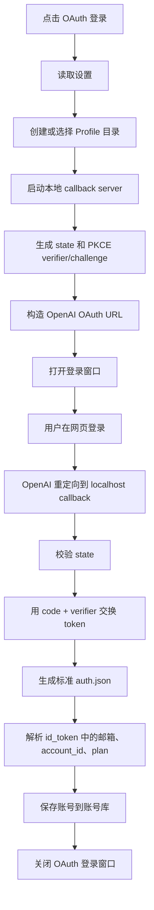

# Codex Switch OAuth 登录流程说明

本文说明 Codex Switch 当前实现的 OAuth 登录流程，用于理解“点击 OAuth 登录后发生了什么”、为什么需要 Profile、token 如何保存，以及登录失败时应该检查哪里。

## 1. 目标

Codex Switch 的 OAuth 登录不是输入 OpenAI API Key，而是通过 OpenAI/Codex OAuth 流程获取本地登录凭据，并保存成账号库中的 `auth.json`。

登录成功后，账号会出现在账号库中。用户之后可以手动切换到该账号，切换时才会把账号库里的 `auth.json` 写入当前 Codex home。

默认 Codex home：

```text
C:\Users\Y\.codex
```

账号库和登录 Profile 默认在应用数据目录中。

## 2. 关键概念

### auth.json

`auth.json` 是 Codex 本地 OAuth 登录凭据文件，不是普通 API Key。它通常包含：

```json
{
  "auth_mode": "chatgpt",
  "OPENAI_API_KEY": null,
  "tokens": {
    "access_token": "...",
    "id_token": "...",
    "refresh_token": "...",
    "account_id": "..."
  },
  "last_refresh": "..."
}
```

其中 `refresh_token` 可以用于刷新登录状态，请不要分享 `auth.json` 或导出的账号包。

### Profile

Profile 是一个独立的浏览器用户数据目录，用来保存该账号登录时产生的 cookie、cache、localStorage 等数据。

Codex Switch 使用 Profile 的目的只有一个：隔离不同账号的网页登录状态，避免多个账号共用同一份浏览器 cookie。

它不会伪造设备指纹，也不会做反检测。

### 后端代理地址

浏览器登录窗口打开网页是一条网络路径，软件后端交换 token 又是另一条网络请求。

如果浏览器能登录，但 token exchange 返回 `unsupported_country_region_territory`，通常说明软件后端请求没有走同一个网络出口。

设置页的“后端代理地址”用于让下面这些请求走同一个代理：

- OAuth token exchange
- refresh token
- 登录前网络检查

示例：

```text
http://127.0.0.1:7890
```

留空表示直连。

## 3. 主流程

用户点击“OAuth 登录”后，流程如下：



## 4. 启动登录

前端调用后端命令：

```text
start_oauth_login(profile_id?: string)
```

后端会：

- 读取当前设置。
- 生成 `profile_id`。
- 在 WebView2 Profile 目录下创建独立 Profile。
- 取消之前未完成的 OAuth 登录。
- 监听本地 callback 地址。

callback 地址形如：

```text
http://localhost:<port>/auth/callback
```

默认端口是 `1455`。如果被占用，会从该端口开始向后尝试最多 50 个端口。

## 5. PKCE 和 OAuth URL

软件使用 PKCE 流程：

- 生成 `code_verifier`
- 由 `code_verifier` 计算 `code_challenge`
- 生成随机 `state`
- 构造 OAuth URL

主要 OAuth 参数包括：

- `response_type=code`
- `scope=openid email profile offline_access`
- `state`
- `code_challenge`
- `code_challenge_method=S256`
- `redirect_uri=http://localhost:<port>/auth/callback`

首次登录新账号时会带 `prompt=login`，强制显示登录流程。

对已有账号点“重新登录”时，会复用该账号保存的 Profile，并尽量保留原账号卡片信息。

## 6. 登录窗口模式

设置页可以选择 OAuth 登录方式：

### 外部隔离浏览器

默认推荐方式。

软件会优先寻找 Chrome 或 Edge，并用独立 `--user-data-dir` 打开 OAuth 登录窗口。

同时会加上一些参数减少浏览器首次运行干扰：

- `--no-first-run`
- `--no-default-browser-check`
- `--disable-default-apps`
- `--disable-search-engine-choice-screen`
- `--disable-sync`

### 内置 WebView2

软件会创建 Tauri WebView 登录窗口，并指定独立 WebView2 data directory。

窗口大约为：

```text
520 x 760
```

内置 WebView 仍然只做 Profile 隔离，不做任何指纹伪造。

## 7. callback server

OAuth 登录成功后，OpenAI 会把浏览器重定向到本地：

```text
http://localhost:<port>/auth/callback?code=...&state=...
```

软件本地 callback server 会读取请求中的 query。

它会检查：

- 是否有 `error`
- 是否有 `code`
- 是否有 `state`
- `state` 是否和启动登录时生成的一致

如果校验失败，登录失败。

如果校验成功，进入 token exchange。

## 8. token exchange

后端使用 `code`、`redirect_uri` 和 `code_verifier` 请求 OpenAI token endpoint。

请求成功后会得到：

- `access_token`
- `id_token`
- `refresh_token`
- `expires_in`

如果设置了“后端代理地址”，这个请求会走该代理。

常见失败：

```text
HTTP 403 unsupported_country_region_territory
```

这通常表示后端请求出口地区不受支持，或浏览器登录和后端 token exchange 没有走同一个网络出口。

处理方式：

- 在设置页填写后端代理地址。
- 点击登录前网络检查，确认后端出口地区。
- 确认浏览器登录窗口和软件后端使用的是同一个网络环境。

## 9. 生成和保存账号

token exchange 成功后，软件会生成标准 `auth.json`：

```json
{
  "auth_mode": "chatgpt",
  "OPENAI_API_KEY": null,
  "tokens": {
    "access_token": "...",
    "id_token": "...",
    "refresh_token": "...",
    "account_id": "..."
  },
  "last_refresh": "..."
}
```

然后软件会解析 `id_token` 中的 JWT claims，提取：

- email
- ChatGPT account id
- plan/type
- subscription metadata

账号保存到账号库，不会自动写入 `C:\Users\Y\.codex\auth.json`。

只有用户点击切换账号时，才会执行账号切换流程。

## 10. 重新登录已有账号

账号卡上的“登录”会调用：

```text
start_account_relogin(account_id)
```

它和新账号登录的区别是：

- 复用该账号已有 Profile 目录。
- 登录成功后尽量保留原账号卡片 ID。
- 用新的 OAuth token 覆盖该账号库记录中的 `auth.json`。

这适合修复某个账号 token 失效、refresh token 失效、或者需要重新授权的情况。

## 11. 刷新 token

账号卡或额度页中的“刷新”会调用：

```text
refresh_account_tokens(account_id)
```

流程：

1. 从账号库读取该账号保存的 `refresh_token`。
2. 请求 OpenAI token endpoint。
3. 生成新的 `auth.json`。
4. 更新账号库。

如果响应里没有新的 `refresh_token`，软件会保留旧的 `refresh_token`。

如果设置了后端代理地址，刷新请求也会走该代理。

## 12. 和账号切换的关系

OAuth 登录只负责“获取并保存账号凭据”。

账号切换是另一条流程：

1. 关闭 Codex 桌面端。
2. 备份当前 Codex home 的 `auth.json` 和 `config.toml`。
3. 写入目标账号的 `auth.json`。
4. 按“当前配置优先”合并 `config.toml`。
5. 原本 Codex 已打开时，再尝试重新打开 Codex。

因此，登录成功后不会立刻影响当前 Codex 登录状态。用户需要手动切换到该账号。

## 13. 常见问题

### OAuth callback 端口被占用

提示类似：

```text
OAuth callback 端口 1455 到 1504 都无法监听
```

说明这些端口已被其他进程占用，或者之前的登录流程还没完全结束。

处理方式：

- 关闭未完成的 OAuth 登录。
- 等几秒后重试。
- 在设置页修改 callback 端口。

### 登录窗口打开了，但最后 token exchange 失败

优先检查：

- 后端代理地址是否正确。
- 登录前网络检查是否通过。
- 代理软件是否允许本软件后端请求通过。
- 浏览器登录窗口和后端 token exchange 是否走同一个出口。

### 登录成功但账号没有切换

这是正常行为。

OAuth 登录只把账号保存到账号库。要让 Codex 桌面端使用该账号，需要在账号页或额度页手动切换。

### Profile 要不要删除

Profile 保存网页登录会话。删除后不会删除账号库中的 `auth.json`，但下次重新登录该账号可能需要重新输入账号密码或完成验证。

## 14. 安全提醒

- 不要分享 `auth.json`。
- 不要分享账号包。
- 不要把 `refresh_token` 发到聊天、Issue、邮件或截图里。
- 只使用你自己拥有或有权使用的账号。
- 后端代理地址只影响软件后端请求，不会改变平台规则。

